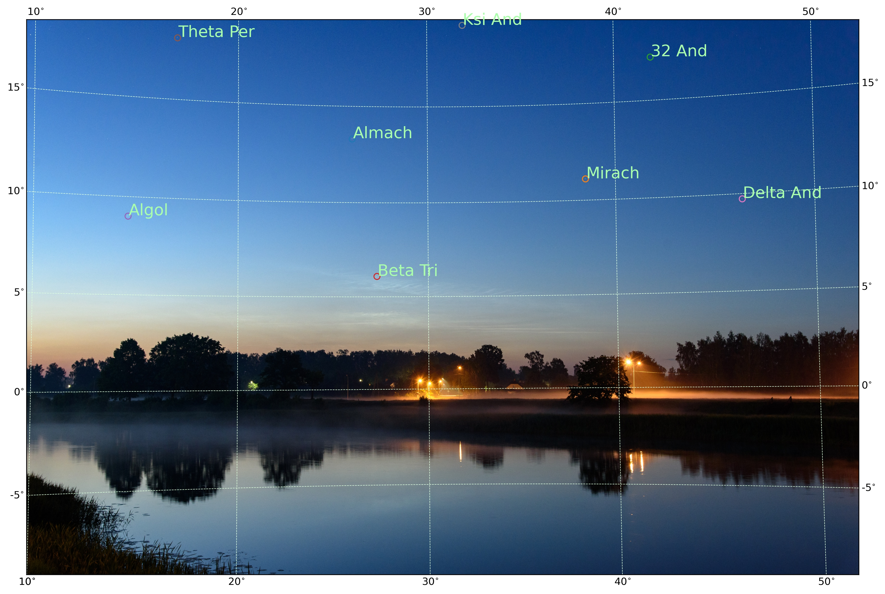
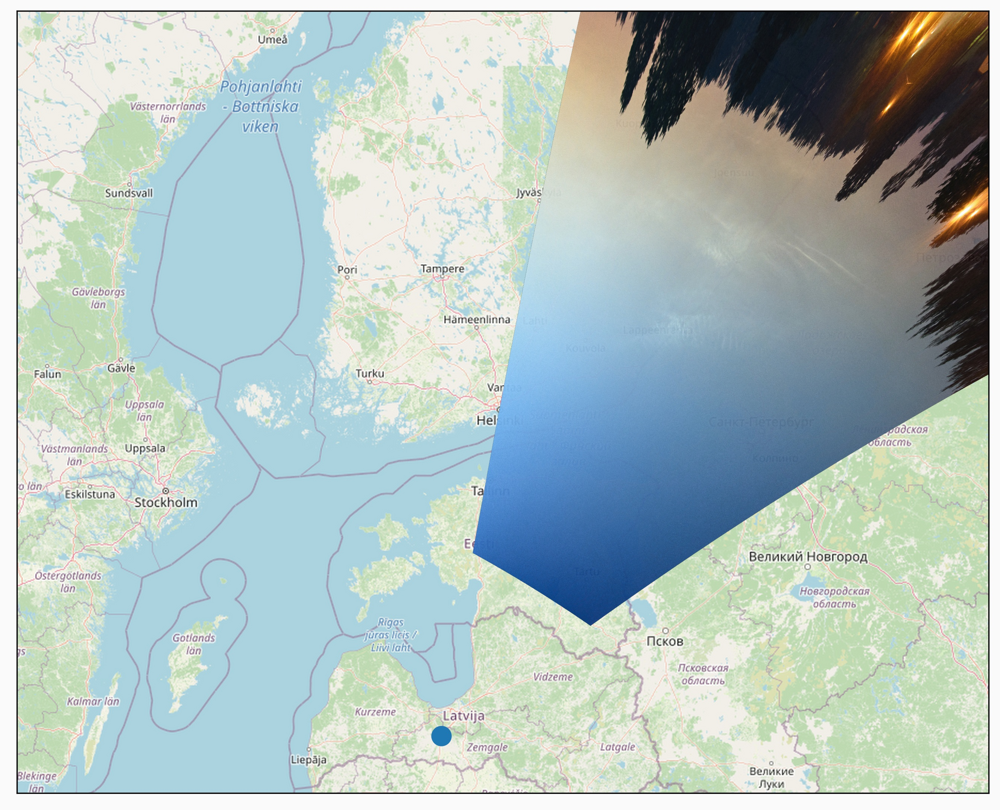

## Sudrabaino mākoņu apstrādes pakotne  

Pakotnes pamatdaļa atrodas failā ```cloudimage.py```. Pamata objekts ir ```CloudImage``` - tas atbilst vienam sudrabaino mākoņu attēlam.

Šo objektu inicializējam norādot identifikatoru un attēla jpg faila nosaukumu
```
from sudrabainiemakoni.cloudimage import CloudImage
cldim = CloudImage('js_202206120030', 'js_202206120030.jpg')
```
Norādam datumu, pieprasot to no EXIF
```
cldim.setDateFromExif()
```
Alternatīvi varam arī tieši uzstādīt datumu
```
cldim.setDate(datetime.datetime(2021,6,15,0,30,21))
```
Uzstādām novērotāja ģeogrāfisko platumu un garumu (grādos)
```
cldim.setLocation(lat=lat, lon=lon)
```
Uzstādām zvaigžņu nosakumu sarakstu un pikseļu koordinātu sarakstu. Nosaukumiem jāatbilst tādiem zvaigžņu nosaukumiem, ko atpazīst [SIMBAD](http://cds.u-strasbg.fr/cgi-bin/Sesame) astronomisko objektu pieprasījumu datubāze Pikseļu koordinātes ir saraksts [[ix1,iy1],[ix2,iy2],...]. Zvaigžņu nosaukumu un pikseļu koordināšu saraksta garumam jābūt vienādam.
```
cldim.setStarReferences(starnames, pixels)
```
Ja zvaigžnu saraksts un pikseļu koordinātes dotas teksta failā, piemērs [šeit](../examples/TestCommandLine/js_202206120030_zvaigznes.txt), tad var to ielasīt izmantojot pandas bibliotēku šādi
```
df = pandas.read_csv(fails_ar_zvaigznu_sarakstu, sep='\t', header=None)
starnames = df[0]
pixels=np.array(df[[1,2]])
cldim.setStarReferences(starnames, pixels)
```

Ja nepieciešams uzzīmēt ekvatoriālo koordinātu režģi uz attēla, tad vispirs jāiegūst attēlam piesaistīta WCS koordinātu sistēma
```
cldim.GetWCS(sip_degree=2, fit_parameters={'projection':'TAN'})
```
Tad ekvatoriālo koordinātu režģi uz attēla iegūst sekojoši, norādot katalogu, kurā noglabāt attēlu. Attēla vārds būs formā ekv_koord_{id}.jpg. 
```
from sudrabainiemakoni import plots
plots.PlotRADecGrid(cldim, outImageDir = katalogs,  stars = False, showplot=False )
```
Turpmākām darbībām ar attēlu nepieciešams veikt attēla kameras referencēšanu. Šajā solī tiks aprēķināts kameras novietojums topocentriskajā koordinātu sistēmā ([ENU](https://en.wikipedia.org/wiki/Local_tangent_plane_coordinates)) un ģeocentriskajā koordinātu sistēmā ([ECEF](https://en.wikipedia.org/wiki/Earth-centered,_Earth-fixed_coordinate_system)). Uz ekrāna tiks izdrukāta novietojuma nesaiste pikseļos.
```
cldim.PrepareCamera()
```
Referencētās kameras var noglabāt JSON failos. Tiks noglabāti divi JSON faili, atbilstoši ENU un ECEF koordinātu sistēmām
```
cldim.SaveCamera(jsonfailavards)
```
Atkārtoti kameras var lietot tās nereferencējot, bet ielasot to parametrus no faila
```
cldim.LoadCamera(jsonfailavards)
```

Pēc kameras referencēšanas, var iegūt attēlu ar horizontālo koordinātu režģi, norādot katalogu, kurā noglabāt attēlu. Attēla vārds būs formā horiz_koord_{id}.jpg. 
```
plots.PlotAltAzGrid(cldim,  outImageDir = katalogs, stars = True, showplot=False, from_camera = True)
```
Ja attēla kamera ir referencēta, tad arī tikai vienam attēlam, iespējams iegūt ģeoreferencētu sudrabaino mākoņu attēlu, pieņemot, ka mākoņu augstums virs zemes virsmas ir fiksēts (piemēram 80 km). Karte tiks zīmēta [WebMercator](https://en.wikipedia.org/wiki/Web_Mercator_projection) projekcijā, izmantojot OpenStreetMap kartes pamatni. Lai inicializētu kartes zīmēšanu jāizveido ```WebMercatorImage``` tipa objekts, kas atbilst uz kartes projicētam sudrabaino mākoņu attēlam. To inicializējot jānorāda ģeogrāfiskā garuma un platuma robežas un attēla pikseļa izšķirtspēju kilometros (tipiski 0.5 km)
```
from sudrabainiemakoni.cloudimage import WebMercatorImage
webmerc = WebMercatorImage(cldim, lonmin, lonmax, latmin, latmax, horizontal_resolution_km)
```
Tālāk jāizveido attēls to projicējot uz noteiktu augstumu (```reprojectHeight``` ir augstums kilometros (tipiski 80)). projected_image_hght saturēs projicēto attēlu
```
webmerc.prepare_reproject_from_camera(reprojectHeight)
projected_image_hght=webmerc.Fill_projectedImageMasked()
```
Lai iegūtu attēlu uz kartes pamatnes lietojam ```plots.PlotReferencedImages``` funkciju. ```camera_points`` mainīgais ļauj uzzīmēt uz kartes punktus (tipiski novērotāja punktu). Jānorāda arī kartes apgabala ģeogrāfiskā garuma un platuma robežas. Parametrs ```alpha``` ļauj regulēt projicētā mākoņu attēla caurspīdību
```
pp=[[cldim.location.lon.value, cldim.location.lat.value]]
plots.PlotReferencedImages(webmerc, [projected_image_hght],
                               camera_points=pp,
                               outputFileName=kartesfailavards,
                               lonmin=map_lonmin, lonmax=map_lonmax, latmin=map_latmin, latmax=map_latmax,
                               alpha=0.9)
```

